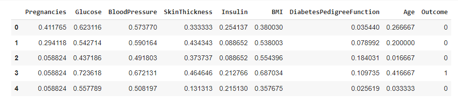

# Diabetic predictions.

## Descriptin
In this assignment,Use scikit-learn to implement Logistic Regression ( LR ) and K-Nearest Neighbor ( KNN ) classifiers on the provided Diabetic dataset.The dataset has been standardized
and split into training and testing.Through this assignment, 
the first 576 rows (75%) for training and the remaining 192 rows (25%) for testing.There are 2 classes in this dataset, and each sample in provided dataset has 8 features.

# Conclusion

• Transforming data from high dimensions to low dimensions for its dense where the similar points collected together.

• gaining information by using PCA and extract new features from the original data.

• dropping features that can explained by another features will introduce the date more clearly.
